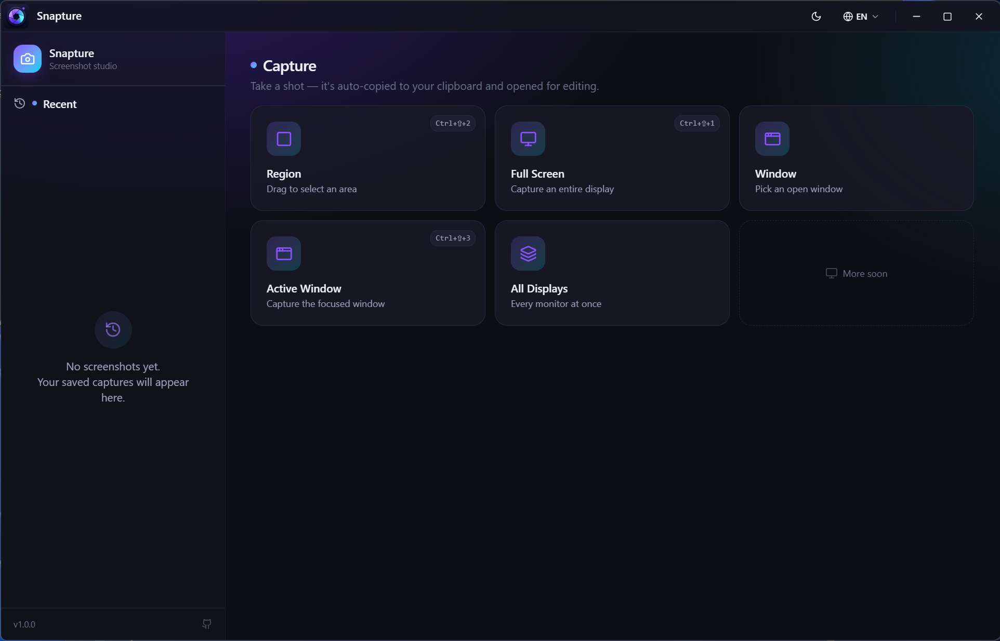
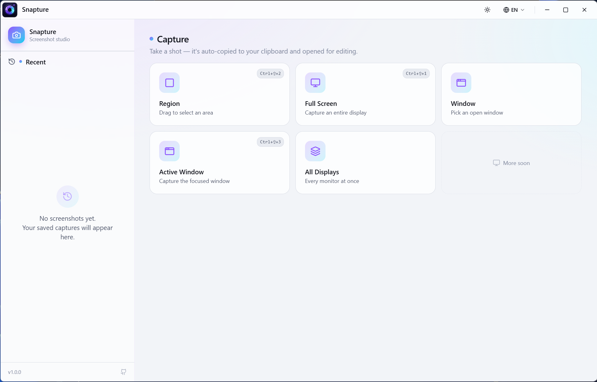
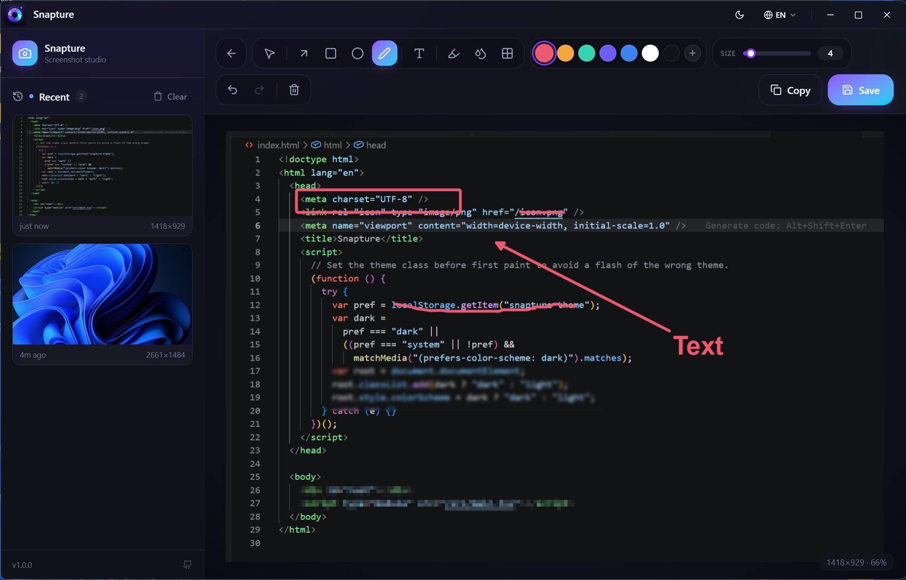
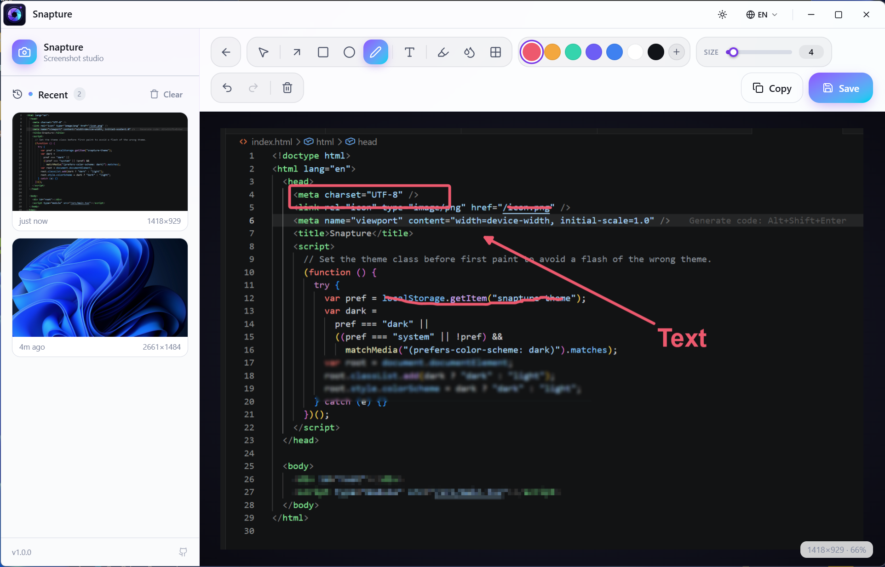

<div align="center">

# Snapture

**A modern screenshot studio for creators and developers**


[Features](#key-features) · [Screenshots](#screenshots) · [Getting Started](#getting-started) · [Tech Stack](#tech-stack) · [Contributing](#contributing) · [License](#license)

---

</div>

## Screenshots

<table align="center">
  <tr>
    <td align="center"><strong>Dark Mode</strong></td>
    <td align="center"><strong>Light Mode</strong></td>
  </tr>
  <tr>
    <td></td>
    <td></td>
  </tr>
  <tr>
    <td align="center"><strong>Editor (Dark)</strong></td>
    <td align="center"><strong>Editor (Light)</strong></td>
  </tr>
  <tr>
    <td></td>
    <td></td>
  </tr>
</table>

## Key Features

### 📸 Flexible Capture Modes
- **Full Screen** — Capture any monitor with a single click; pick your display on multi-monitor setups.
- **Region** — Drag to select any area of the screen with a live frozen overlay.
- **Window** — Pick any open window from the list, or capture the currently active one instantly.
- **All Displays** — Grab every monitor at once.
- **Global Hotkeys** — `Ctrl+Shift+1` (full screen), `Ctrl+Shift+2` (region), `Ctrl+Shift+3` (active window).

### ✏️ Powerful Annotation Editor
- Arrows, rectangles, ellipses, and freehand pen.
- Highlighter for emphasis, **blur & pixelate** for redacting sensitive information.
- Text overlays with inline double-click editing.
- Undo / redo, move & resize annotations, color picker, and stroke-width controls.
- All annotations are baked directly into the exported image.

### ⚡ Speed & Polish
- **Auto-clipboard** — Every capture is instantly copied to your clipboard.
- **Custom title bar** — Built-in theme toggle (dark/light/system) and language selector right in the header.
- **Recent history** — Browse, reopen, or delete past screenshots from the sidebar.
- **Native save dialog** — Export as PNG or JPEG with a native OS file picker.

### 🌍 Multi-Language Support
Switch languages on the fly via the header dropdown. Currently ships with English, 中文 (Chinese), Español (Spanish), हिन्दी (Hindi), and မြန်မာဘာသာ (Burmese).

## Tech Stack

| Layer | Technology |
|---|---|
| Desktop Shell | [Tauri 2](https://v2.tauri.app/) (Rust) |
| Frontend | [React 19](https://react.dev/) + [TypeScript](https://www.typescriptlang.org/) |
| Build Tool | [Vite](https://vitejs.dev/) |
| Styling | [Tailwind CSS v4](https://tailwindcss.com/) |
| Icons | [Lucide React](https://lucide.dev/) |
| Editor Canvas | [Konva](https://konvajs.org/) + [react-konva](https://konvajs.org/docs/react/) |
| State Management | [Zustand](https://github.com/pmndrs/zustand) |
| i18n | [i18next](https://www.i18next.com/) |
| Screen Capture | [`xcap`](https://crates.io/crates/xcap) |
| Image Processing | [`image`](https://crates.io/crates/image) |

## Getting Started

### Prerequisites

| Requirement | Version |
|---|---|
| [Node.js](https://nodejs.org/) | >= 18 |
| [Rust](https://www.rust-lang.org/tools/install) | stable (latest) |
| [Tauri 2 prerequisites](https://v2.tauri.app/start/prerequisites/) | platform-specific |

#### Platform Dependencies

**Windows:** [Microsoft Visual Studio C++ Build Tools](https://visualstudio.microsoft.com/visual-cpp-build-tools/) + [WebView2](https://developer.microsoft.com/en-us/microsoft-edge/webview2/)

**macOS:** Xcode Command Line Tools (`xcode-select --install`)

**Linux (Debian/Ubuntu):**
```bash
sudo apt install libwebkit2gtk-4.1-dev libgtk-3-dev libayatana-appindicator3-dev librsvg2-dev
```

### Install & Run

```bash
# Clone the repository
git clone https://github.com/KoPyae2/screen-shoot-app.git
cd screen-shoot-app

# Install dependencies
npm install

# Launch the app in development mode
npm run dev:tauri
```

### Build for Production

```bash
# Build for your current platform
npm run build:tauri
```

Platform-specific builds are available via `npm run build:windows`, `npm run build:macos`, `npm run build:linux`, and variants. See the `scripts` section in `package.json` for the full list.

## Contributing

Contributions are welcome and appreciated! Here's how you can help:

- **🐛 Report bugs** — Open an issue with a clear description and reproduction steps.
- **💡 Suggest features** — Open a discussion or feature request.
- **🔧 Submit pull requests** — Fix bugs, improve the UI, or add new functionality.
- **🌍 Add a translation** — Creating a new language is as simple as adding a JSON file:
  1. Copy `src/i18n/locales/en.json` to `src/i18n/locales/your-lang-code.json`
  2. Translate the values (keep the keys unchanged)
  3. Import & register it in `src/i18n/i18n.ts`
  4. Add the language entry in `src/components/ui/Header.tsx` (the `LANGUAGES` array)

## License

[MIT](LICENSE) © Snapture Contributors
